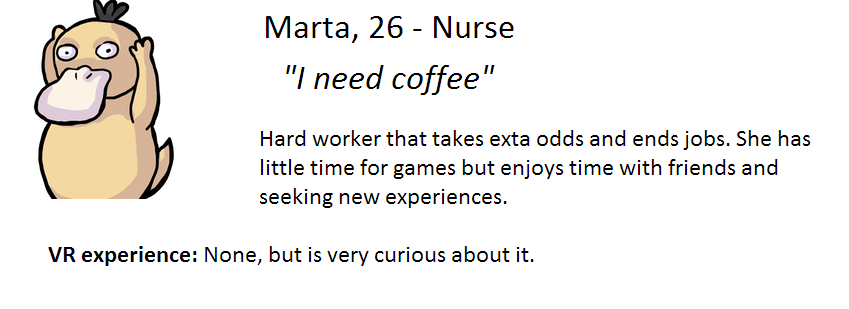
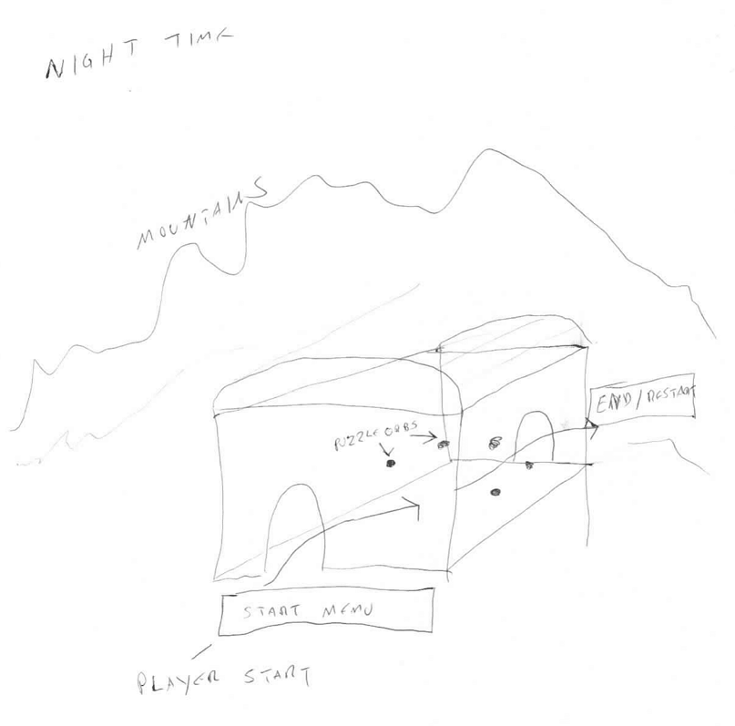
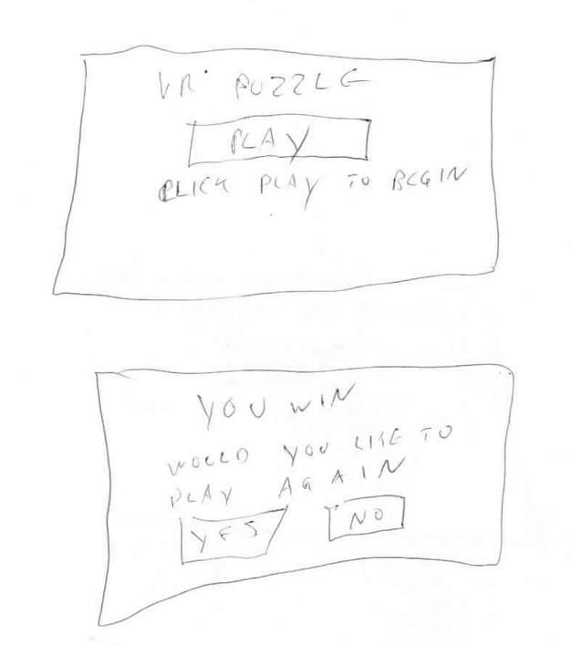
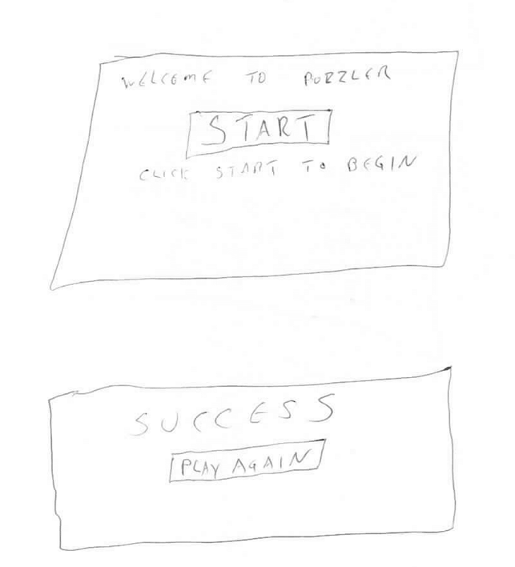
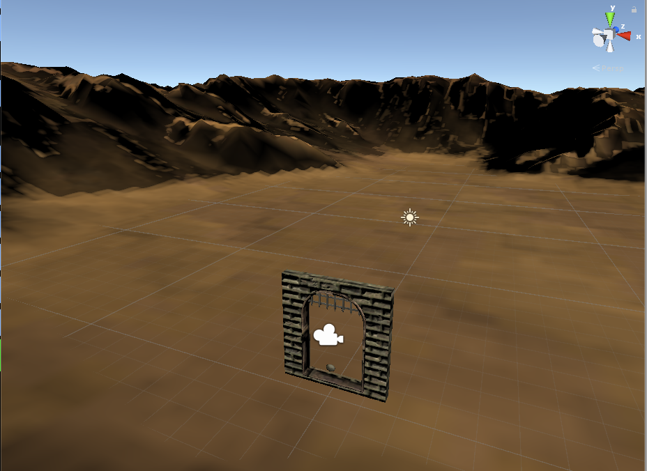
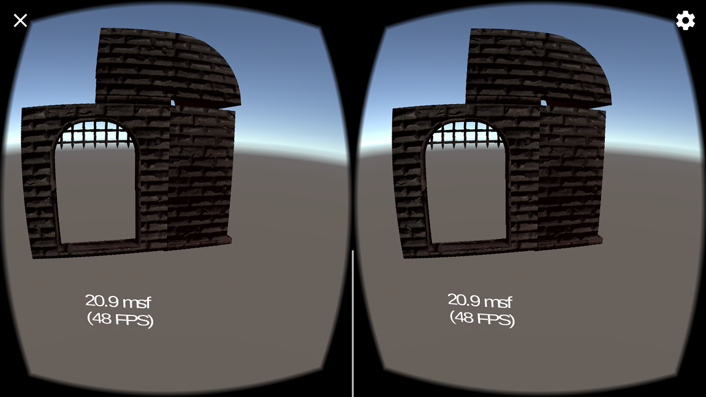
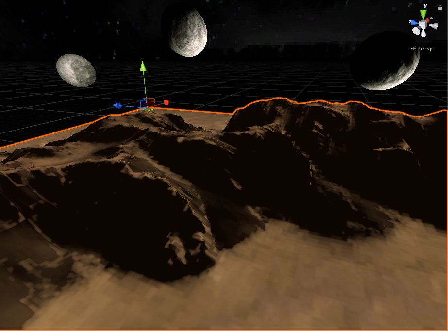
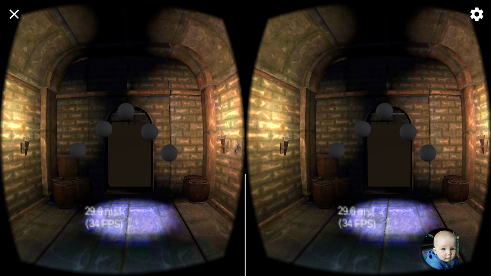
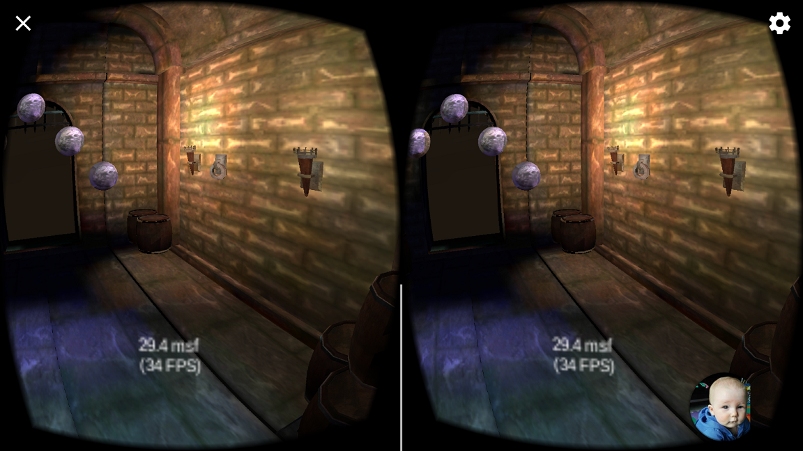
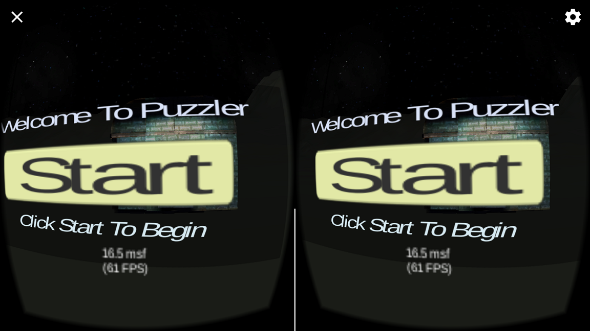

<h1>Puzzler</h1>
 <h3>Statement of purpose </h3>
 
 Puzzler is a VR app that allows users to experience VR in a way that does not require a large time investment to enjoy.
 
 

<iframe width="400" height="300"
src="gameplay.webm">
</iframe>

<h1><strong>Process</strong></h1>

Profile of the user that the application was targeted at:

<h2>&nbsp;&nbsp;&nbsp;&nbsp;Design sketches</h2>

<h2>&nbsp;&nbsp;&nbsp;&nbsp;UI Design Sketches</h2>

<h1><strong>User Tests</strong></h1>

<h3>&nbsp;&nbsp;&nbsp;&nbsp;User Test 1</h3>

What is the mood? "Dark and spooky." Is everything comfortably visible?  
"Yes the room is in view, mountains behind but nothing interesting to see there." 
Do you feel the appropriate size?  "Seems like a fantasy place so I’m not sure what’s appropriate, I feel a little shorter What I am. " Is there anything distracting from the orbs?  "Yes some walls not quite together, some flickering in the corners,and it seems overall a bit too dark."   

Made multiple lighting and geometric adjustments to address users concerns.

	

<h3>&nbsp;&nbsp;&nbsp;&nbsp;User Test 2</h3>

What do you think will happen if you click the button? "The game will start." Comments or suggestions reguarding the menus? User feels the menus are easy to understand, but is a little confused about where to look to click the button, added the GVR reticle and the problem is solved.

<h3>&nbsp;&nbsp;&nbsp;&nbsp;User Test 3</h3>

Can you describe the movement? "I just zipped into the room." Did the movement cause any discomfort? "It made me slightly dizzy for a second." Would you be more comfortable with it slower? "No, I like that speed, it was fun." Do you think extended exposure to that movement could make you sick? "I don’t think so, I just didn’t expect it at first."   
Adjusted speed moving from menu into puzzle.

<h3>&nbsp;&nbsp;&nbsp;&nbsp;User Test 4</h3>

Is the object of the game clear, and is it easy to understand the steps required to complete the puzzle?  "Yes, pretty clear, after a few minutes, I didn't understand at first but I think the ball should flash brighter." Is there any way to make the intent of the puzzle more clear? "Not that I can think of, I figured it out eventually." Are there any comments, concerns or suggestions? "I think the movement going back to the start menu is too fast. Also the crickets and music are too loud for me. Other than those I think it is really neat."  
Adjusted audio levels, speed of movement from reset to start, and changed the ball flash color to address users concerns. 

 

<h1><strong>Development</strong></h1>

Setting scale by loading door into application and comparing it to real doors.

  

Partial building used to adjust scale.

  

Added night skybox with moons to scene to match dark mood.

  

First positioning of orbs.

  

Added moon material to orbs, and began finalizing lighting.

  

Ready to play! Many lighting adjustments and optimizations were done to increase framerate on  device. 

  

<h1><strong>Result</strong></h1>

One level of the puzzler is complete, and can easily be extended to travel to different areas of the environment to complete other puzzles; However, The user 
is satisfied with this application because it allowed them to experience VR in an engaging way for the first time without requireing much time.

<h1><strong>Other Projects</strong></h1>

Check out my other projects at <a href ="https://github.com/mi7flat5">www.github.com/mi7flat5</a>, and keep an eye on <a href ="https://mi7flat5.github.io">mi7flat5.github.io</a> for other project pages like this one.

